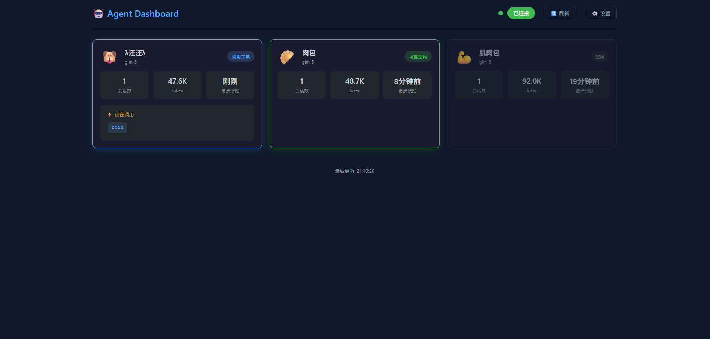

<div align="center">

# 🤖 KClaw Agent Dashboard

**实时监控你的 AI Agent，一目了然**

[](https://opensource.org/licenses/MIT)
[](https://nodejs.org/)
[](#)
[](#)

[English](#english) · [中文](#中文)

</div>

---

## 🖼️ 界面预览



---

## ✨ 功能特性

| 功能 | 说明 |
|------|------|
| 🔄 **实时状态监控** | 一眼看清所有 Agent 是空闲、思考中、还是正在调用工具 |
| 📊 **Token 使用追踪** | 可视化进度条，临近阈值时自动变色预警 |
| 🌐 **多渠道来源** | 支持 Telegram、Discord、WebChat 等多种渠道的 Agent 监控 |
| 📜 **历史记录** | 30 分钟内活跃过的 Agent 都会保留，不会突然"消失" |
| 🔍 **快速搜索** | 按名称、状态、渠道快速筛选 Agent |
| 🌍 **多语言** | 中英文界面一键切换 |
| ⚙️ **零配置启动** | 自动读取 OpenClaw 配置，开箱即用 |

---

## 🚀 快速启动

### 方式一：直接启动

```bash
git clone https://github.com/Kaiji-Z/KClaw-agent-dashboard.git
cd KClaw-agent-dashboard
node server.js
```

访问 **[http://localhost:3456/](http://localhost:3456/)**

### 方式二：环境变量

```bash
export DASHBOARD_PORT=8080
export GATEWAY_URL="http://192.168.1.100:18789"
export LANGUAGE=en
node server.js
```

### 方式三：PM2 后台运行（生产环境推荐）

```bash
npm install -g pm2
pm2 start server.js --name kclaw-dashboard
pm2 save
```

---

## 📱 手机访问（局域网内）

同一 WiFi 下，可以用手机浏览器访问 Dashboard：

1. 查看电脑 IP 地址

   ```bash
   # Windows
   ipconfig
   
   # Mac/Linux
   ifconfig
   ```

2. 手机浏览器访问：`http://你的电脑IP:3456`

> ⚠️ **注意**：仅限同一局域网（同一 WiFi）内访问。

<details>
<summary><strong>🔧 无法连接排查</strong></summary>

- **Gateway 绑定地址** — 确保 `~/.openclaw/openclaw.json` 中 `gateway.bind` 不是 `loopback`：
  ```json
  { "gateway": { "bind": "0.0.0.0" } }
  ```

- **Windows 防火墙** — 可能需要放行 3456 端口：
  - 控制面板 → Windows Defender 防火墙 → 高级设置
  - 入站规则 → 新建规则 → 端口 → 3456 → 允许连接

- **确认在同一网络** — 手机和电脑必须连接同一个 WiFi

</details>

---

## ⚙️ 配置说明

| 配置项 | 环境变量 | 默认值 | 说明 |
|--------|----------|--------|------|
| `port` | `DASHBOARD_PORT` | 3456 | Dashboard 服务端口 |
| `gatewayUrl` | `GATEWAY_URL` | 自动检测 | Gateway 地址 |
| `refreshInterval` | — | 1500 | 刷新间隔（毫秒） |
| `language` | `LANGUAGE` | zh-CN | 界面语言 |
| `agents` | — | {} | Agent 显示名称配置 |

---

## 🎯 状态说明

Dashboard 会实时分析 Agent 的状态：

| 状态 | 颜色 | 含义 |
|------|------|------|
| 🟢 **活跃** | 绿色 | Agent 刚刚有过活动 |
| 🟡 **思考中** | 黄色 | Agent 正在生成回复（可见思考内容） |
| 🔵 **调用工具** | 蓝色 | Agent 正在调用工具（显示工具名称） |
| ⚪ **空闲** | 灰色 | Agent 超过 10 分钟无活动 |

---

## 📁 项目结构

```
KClaw-agent-dashboard/
├── server.js      # 后端服务（零依赖）
├── index.html     # 前端界面
├── config.json5   # 配置文件（可选）
├── AGENT.md       # Agent 使用指南
├── SKILL.md       # Skill 集成文档
├── README.md      # 本文档
└── screenshot1.png # 界面截图
```

---

## 🤝 贡献

欢迎提交 Issue 和 Pull Request！

---

## 📄 许可证

[MIT](LICENSE) © 2024

---

<div align="center">

**[⬆ Back to Top](#-kclaw-agent-dashboard)**

Made with ❤️ for the OpenClaw community

</div>

---

# English

## ✨ Features

| Feature | Description |
|---------|-------------|
| 🔄 **Real-time Status** | See at a glance if agents are idle, thinking, or using tools |
| 📊 **Token Tracking** | Visual progress bar with color-coded warnings |
| 🌐 **Multi-channel** | Monitor agents from Telegram, Discord, WebChat, etc. |
| 📜 **History** | Agents active within 30 minutes are preserved |
| 🔍 **Quick Search** | Filter by name, status, or channel |
| 🌍 **i18n** | Switch between Chinese and English |
| ⚙️ **Zero Config** | Auto-reads OpenClaw config, works out of the box |

## 🚀 Quick Start

```bash
git clone https://github.com/Kaiji-Z/KClaw-agent-dashboard.git
cd KClaw-agent-dashboard
node server.js
```

Visit **[http://localhost:3456/](http://localhost:3456/)**

## 📱 Mobile Access (LAN Only)

Access from your phone within the same WiFi network:

1. Find your computer IP

   ```bash
   # Windows
   ipconfig
   
   # Mac/Linux
   ifconfig
   ```

2. Phone browser: `http://YOUR_COMPUTER_IP:3456`

> ⚠️ **Note**: Only works within the same LAN (same WiFi).

<details>
<summary><strong>🔧 Troubleshooting</strong></summary>

- **Gateway bind address** — Ensure `gateway.bind` is not `loopback` in `~/.openclaw/openclaw.json`:
  ```json
  { "gateway": { "bind": "0.0.0.0" } }
  ```

- **Windows Firewall** — Allow port 3456:
  - Control Panel → Windows Defender Firewall → Advanced Settings
  - Inbound Rules → New Rule → Port → 3456 → Allow Connection

- **Same Network** — Phone and computer must be on the same WiFi

</details>

## ⚙️ Configuration

Create `config.json5`:

```json
{
  "port": 3456,
  "gatewayUrl": "http://127.0.0.1:18789",
  "refreshInterval": 1500,
  "language": "en",
  "agents": {
    "my-assistant": { "name": "AI Assistant", "emoji": "🤖" }
  }
}
```

## 📄 License

[MIT](LICENSE) © 2024
